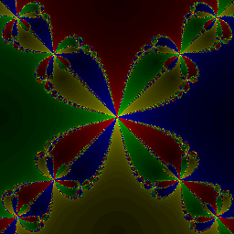
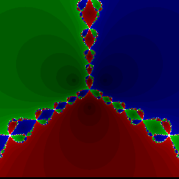

# Newton Fractal

Python3 based [Newton fractal](https://en.wikipedia.org/wiki/Newton_fractal) calculation. This script makes use of all your cores by spawning multiple processes.

You can easily change the used function to generate fractals as you like. For example: `f(z) = z^4 - 1`

You can use the `-l` option to loop the frame generation with a slight zoom. For example: `f(z) = z^3 - 1`

## Get it running
Just install [Python3](https://www.python.org/downloads/). Then use *PIP3* to install [NumPi](https://github.com/numpy/numpy) and the [argparse](https://github.com/cjerdonek/python-argparse) module:

	pip3 install numpy
	pip3 install argparse

***

# Usage:
- **-h, --help** *show a help message and exit*
- **-v, --verbose** *enables verbose mode*
- **-l, --loop** *starts infinite calculation loop for many frames*
- **-i ITERATIONS, --iterations ITERATIONS** *specifies the number of pixels of one edge*
- **-p PROCESSCOUNT, --processcount PROCESSCOUNT** *specifies the number of processes*

***

# Apart of the code

## Contribution & Contributors

I'd love to see your ideas for improving this project!
The best way to contribute is by submitting a pull request or a [new Github issue](https://github.com/RGreinacher/NewtonFractal/issues/new). :octocat:

## Author:

[Robert Greinacher](mailto:development@robert-greinacher.de?subject=GitHub Newton Fractal) / [@RGreinacher](https://twitter.com/RGreinacher) / [LinkedIn](https://www.linkedin.com/profile/view?id=377637892)

Thank you for reading this and for your interest in my work. I hope I could help you or even make your day a little better. Cheers!

## License:

Newton Fractal is available under the MIT license. See the LICENSE file for more info.

*[Thanks [Tom](https://github.com/TomKnig) for the inspiration of this last passage.]*
